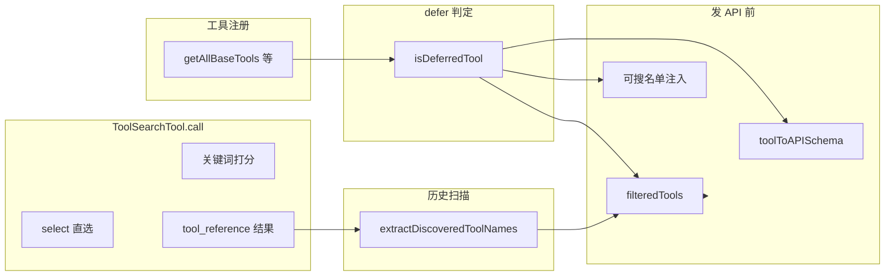

# ToolSearchTool 深度解析

本文基于本仓库源码，说明在 **工具数量很多**（尤其 MCP 动态接入）时，客户端如何把「全量工具池」拆成 **常驻工具** 与 **延迟（deferred）工具**，并通过名为 **`ToolSearch`**（常量 `TOOL_SEARCH_TOOL_NAME`，见 [`src/tools/ToolSearchTool/constants.ts`](../src/tools/ToolSearchTool/constants.ts)）的专用工具完成检索与「解锁」，再与 API 侧的 `defer_loading`、`tool_reference` 协同，让模型在上下文可控的前提下仍能调用任意 deferred 工具。

> 若你只需要主循环层面的概要，可先读 [大模型工具调用与客户端编排.md](./大模型工具调用与客户端编排.md) 第 1.3 节；本文在该节基础上把设计拆到函数级。

---

## 1. 思考步骤（建议按此顺序阅读源码）

1. **先分清三件事**：哪些工具算 deferred、每轮请求里 **API 的 `tools` 数组里实际出现谁**、模型怎么知道「还有哪些名字可搜」。
2. **再跟一条数据流**：`ToolSearch` 的 `tool_result` 里出现 `tool_reference` → 后续轮次 `extractDiscoveredToolNames` 扫历史 → `filteredTools` 把对应 deferred 工具塞进 schema。
3. **最后看搜索本身**：`select:` 直选 vs 关键词打分、MCP 命名、缓存与 MCP 连接中状态。

---

## 2. 背景与动机

- **问题**：每个工具都要带 **名称 + 描述 + `input_schema`**。MCP 一多，光工具定义就会吃掉大量 token，还会让 **prompt 缓存**频繁失效（同一段 system / tools 字节变化大）。
- **思路**：把一部分工具标为 **deferred**：在 API 请求里带上 `defer_loading: true`（仅声明占位，完整 schema 由服务端在「发现」之后再注入模型上下文）。客户端再提供 **`ToolSearch`**，让模型用关键词或 `select:工具名` 从 deferred 池里捞出目标；返回结果用 **`tool_reference`** 块指向工具名，后续轮次把这些名字对应的 **完整定义**补进 `tools` 列表。
- **结果**：单轮请求里的 `tools` 数组可以 **很小**（核心工具 + `ToolSearch` + 已解锁的 deferred），同时 **不硬性限制** MCP 工具总量（见 [`src/utils/toolSearch.ts`](../src/utils/toolSearch.ts) 中 `extractDiscoveredToolNames` 的注释）。

---

## 3. 概念词典

| 术语 | 含义（本仓库语境） |
|------|-------------------|
| **deferred 工具** | `isDeferredTool(tool)` 为真的工具：典型为全部 MCP（可 `alwaysLoad` 豁免）以及显式 `shouldDefer: true` 的内置工具。 |
| **`defer_loading`** | 发给 API 的 tool schema 上的布尔字段；由 [`src/utils/api.ts`](../src/utils/api.ts) 的 `toolToAPISchema(..., { deferLoading: true })` 叠加在 **按请求拷贝** 的 schema 上，不写入 session 级缓存的 base 对象。 |
| **`tool_reference`** | `tool_result` 的数组内容里的一种块类型：`{ type: 'tool_reference', tool_name: string }`。由 `ToolSearch` 的 `mapToolResultToToolResultBlockParam` 生成；SDK 类型未必完整覆盖，故代码里多处 runtime 检查。 |
| **discovered set（已发现集合）** | `extractDiscoveredToolNames(messages)` 返回的 `Set`：历史上所有出现在 `tool_reference` 里的工具名，外加 compact 边界携带的快照字段。用于决定 **下一轮是否要把某 deferred 工具的完整 schema 放进 `filteredTools`**。 |
| **`ToolSearch` / `ToolSearchTool`** | 用户可见能力名多为「Tool Search」；源码里工具对象导出名 `ToolSearchTool`，API 上的 `name` 字段为 **`ToolSearch`**。 |

---

## 4. 谁会被 defer：`isDeferredTool`

核心实现：[`src/tools/ToolSearchTool/prompt.ts`](../src/tools/ToolSearchTool/prompt.ts) 中的 `isDeferredTool`。

**判定顺序（简表）**

| 条件 | 结果 |
|------|------|
| `tool.alwaysLoad === true`（MCP 可通过 `_meta['anthropic/alwaysLoad']` 映射） | **不** defer |
| `tool.isMcp === true` | **defer**（除非已被上一行豁免） |
| `tool.name === TOOL_SEARCH_TOOL_NAME`（`ToolSearch`） | **不** defer |
| `FORK_SUBAGENT` 特性开启且为 `Agent` 工具名，且 `isForkSubagentEnabled()` | **不** defer（子 agent 首轮就要用） |
| Kairos / Brief 等条件下 `Brief` 工具名 | **不** defer |
| Kairos 下 `SendUserFile` 且 REPL bridge 激活 | **不** defer |
| `tool.shouldDefer === true` | **defer** |
| 默认 | **不** defer |

**扩展能力短语**：[`src/Tool.ts`](../src/Tool.ts) 上可选字段 `searchHint`（3–10 个词）供 `ToolSearch` 关键词匹配时加权，**不**再渲染进 `<available-deferred-tools>` 行（见 `formatDeferredToolLine` 注释：曾做 A/B，无收益已去掉）。

---

## 5. 总架构：从注册到解锁

---

## 6. 请求流水线（`queryModel` 里发生了什么）

入口：[`src/services/api/claude.ts`](../src/services/api/claude.ts)（`queryModel` 内「Dynamic tool loading」相关段落）。

### 6.1 是否启用 Tool Search：`isToolSearchEnabled`

实现：[`src/utils/toolSearch.ts`](../src/utils/toolSearch.ts) 的 `isToolSearchEnabled(model, tools, ...)`。

**主要闸门**（缺一不可的常见组合）：

- `getToolSearchMode()` 不是 `standard`（环境变量 `ENABLE_TOOL_SEARCH`、以及 `CLAUDE_CODE_DISABLE_EXPERIMENTAL_BETAS` 等对 beta 形状的影响，见同文件 `getToolSearchMode` 注释）。
- `modelSupportsToolReference(model)` 为真（默认 **Haiku** 名命中即不支持；可通过 GrowthBook `tengu_tool_search_unsupported_models` 覆盖）。
- `isToolSearchToolAvailable(tools)` 为真：工具列表里 **必须** 还能找到 `ToolSearch`（被 `disallowedTools` 去掉则整条链路失效）。
- `tst-auto` 模式下还需 deferred 工具定义体量超过自动阈值（`checkAutoThreshold`，与 `countToolDefinitionTokens` 等配合）。

另：**没有 deferred 工具且没有仍连接中的 MCP** 时，会把 `useToolSearch` 置为 false，避免空转（同文件附近注释）。

### 6.2 `filteredTools`：每轮实际参与 `toolSchemas` 的工具

当 `useToolSearch` 为真时逻辑概要：

- **所有非 deferred 工具**：始终保留。
- **`ToolSearch`**：始终保留（否则无法继续解锁）。
- **deferred 工具**：仅当 `extractDiscoveredToolNames(messages)` 里 **已出现** 对应名字时，才把该工具加入本轮 `filteredTools`（即 **动态扩表**）。

当 `useToolSearch` 为假时：从列表中 **移除** `ToolSearch`，并对消息做后处理剥离 `tool_reference` 等（避免换到不支持模型时 400）。

### 6.3 `toolToAPISchema` 与 `defer_loading`

[`src/utils/api.ts`](../src/utils/api.ts)：在 `willDefer(tool)` 为真时传入 `deferLoading: true`，在 **拷贝出的** `schema` 上设置 `defer_loading`，与缓存的 `base` 分离，避免「上一轮 defer、下一轮不 defer」时缓存串味。

### 6.4 Beta 请求头（provider 分支）

[`src/utils/betas.ts`](../src/utils/betas.ts) 的 `getToolSearchBetaHeader()`：

- **Claude API / Foundry**：`advanced-tool-use-2025-11-20`（常量 `TOOL_SEARCH_BETA_HEADER_1P`，定义于 [`src/constants/betas.ts`](../src/constants/betas.ts)）。
- **Vertex / Bedrock**：`tool-search-tool-2025-10-19`（`TOOL_SEARCH_BETA_HEADER_3P`）。

Bedrock 路径下注释说明：该 header 可能需落在 `extraBodyParams` 而非 `betas` 数组（详见 `claude.ts` 同段实现）。

---

## 7. 模型如何知道「有哪些 deferred 名字可搜」

两种模式，由 `isDeferredToolsDeltaEnabled()` 区分（[`src/utils/toolSearch.ts`](../src/utils/toolSearch.ts)）：

| 模式 | 行为 | 取舍 |
|------|------|------|
| **关闭 delta**（默认非 ant、且 GrowthBook `tengu_glacier_2xr` 为 false） | 每次请求前在 `messagesForAPI` **最前** prepend 一条 meta user 消息，内容为 `<available-deferred-tools>` + 每行一个 **`formatDeferredToolLine`**（当前即工具名）。 | 实现简单；deferred 集合一变，prepend 字节就变，**易击穿 prompt cache**。 |
| **开启 delta**（`USER_TYPE === 'ant'` 或 `tengu_glacier_2xr`） | 不再依赖上述大块 prepend；改为由 [`src/utils/attachments.ts`](../src/utils/attachments.ts) 的 `getDeferredToolsDeltaAttachment` 等路径下发 **增量**（`deferred_tools_delta`），`getDeferredToolsDelta` 对比「已宣布名字」与当前 deferred 池算 added/removed。 | 更利于缓存与大规模 MCP；逻辑更分散，需与 compact / 子 agent 扫描上下文对齐（源码内有 `DeferredToolsDeltaScanContext` 分桶埋点说明）。 |

`ToolSearch` 自带文案里也会提示 deferred 名字出现的位置（`<available-deferred-tools>` vs system-reminder），见 [`src/tools/ToolSearchTool/prompt.ts`](../src/tools/ToolSearchTool/prompt.ts) 的 `getToolLocationHint()`。

---

## 8. `ToolSearchTool` 实现详解

文件：[`src/tools/ToolSearchTool/ToolSearchTool.ts`](../src/tools/ToolSearchTool/ToolSearchTool.ts)。

### 8.1 输入输出

- **入参**（`lazySchema` + Zod）：`query: string`，`max_results?: number`（默认 5）。
- **出参**：`matches: string[]`，`query`，`total_deferred_tools`，可选 `pending_mcp_servers`。

### 8.2 `select:` 直选（含多选）

- 正则：`/^select:(.+)$/i`。
- 支持逗号分隔：`select:Read,Edit,Grep`。
- 查找顺序：先在 **deferred** 集合找，再在 **全量** `tools` 找（若已加载则「再选一次」无害，减少子 agent / 压缩后的重试抖动）。
- 若一个都没找到：返回空 `matches`，并可附带 `pending_mcp_servers`（见下）。

### 8.3 关键词搜索 `searchToolsWithKeywords`

- **精确名短路**：query 与某工具名忽略大小写完全一致时，直接返回该工具（先在 deferred、再在全体里找）。
- **MCP 前缀短路**：`mcp__` 开头且长度合理时，按 **名字前缀** 在 deferred 里过滤。
- **分词**：空格分词；`+term` 表示 **必填**（必须在名字部件、描述或 `searchHint` 中满足词边界匹配），其余词用于打分。
- **名字解析 `parseToolName`**：MCP 名 `mcp__server__action` 与 CamelCase 内置名分别拆成可检索片段。
- **打分**：对每项 term 累计分数——名字部件命中、`searchHint` 词边界命中、`tool.prompt()` 拉取的描述词边界命中权重不同；MCP 与内置略有差异系数；按分数排序后 `slice(0, max_results)`。

**性能**：描述通过 `lodash-es/memoize` 按工具名缓存；deferred 集合变化时 `maybeInvalidateCache` 清空缓存（`clearToolSearchDescriptionCache` 供外部命令清理缓存用）。

### 8.4 MCP 仍在连接

`getAppState().mcp.clients` 中 `type === 'pending'` 的服务器名会进入 `pending_mcp_servers`；在 **select 全失败** 或 **关键词零匹配** 时帮助模型理解「不是搜错了，是工具还没挂上来」。

### 8.5 结果如何回到模型：`mapToolResultToToolResultBlockParam`

- 有匹配：`tool_result.content` 为 **`tool_reference` 数组**（每个元素指向 `tool_name`）。注释说明：**1P/Foundry** 路径下由 API 展开；Bedrock/Vertex 可能对客户端侧 expansion 支持不完整。
- 无匹配：退回 **纯文本** 说明；若存在 pending MCP，追加「稍后再搜」类提示。

### 8.6 其它元数据

- `isEnabled`：`isToolSearchEnabledOptimistic()`（与「最终是否 defer」的严格判断分离，用于是否把本工具编进 base 列表等）。
- `isReadOnly` / `isConcurrencySafe`：只读、可并发。
- `renderToolUseMessage`：返回 `null`（UI 层可按需处理）。
- 分析：`logEvent('tengu_tool_search_outcome', ...)`。

---

## 9. 历史扫描与压缩边界

[`src/utils/toolSearch.ts`](../src/utils/toolSearch.ts) 的 `extractDiscoveredToolNames`：

- 扫描 **user** 消息中嵌套的 `tool_result` → 内部 **`tool_reference`**，收集 `tool_name`。
- 遇到 `type === 'system' && subtype === 'compact_boundary'` 时，读取 `compactMetadata.preCompactDiscoveredTools`，把 compact **前**已发现的工具名并回集合（因为 compact 摘要可能丢掉含 `tool_reference` 的原文）。

与 compact 主逻辑的配合见 [`src/services/compact/compact.ts`](../src/services/compact/compact.ts) 中对 `extractDiscoveredToolNames` / `ToolSearchTool` 的引用。

---

## 10. 消息规范化（点到为止）

[`src/utils/messages.ts`](../src/utils/messages.ts) 体量很大，与 Tool Search 相关的要点：

- 当 Tool Search **未**启用或模型切换后不支持时，会 **剥离** `tool_reference`，避免 400。
- 存在 **`tool_reference` 的 user 消息**与相邻文本块的合并/搬迁规则：防止把普通文本与「仅含 tool_reference 的 tool_result」错误 smoosh（注释说明服务端会把 expansion 渲染为 `<functions>...</functions>`，错误嵌套会触发 ValueError）。

细节以源码注释为准，此处不展开每一分支。

---

## 11. 执行路径上的「防呆」：`buildSchemaNotSentHint`

[`src/services/tools/toolExecution.ts`](../src/services/tools/toolExecution.ts)：当某 **deferred** 工具实际已可执行，但 **本轮 API 并未下发其 schema**（故模型按字符串瞎填参数）导致 Zod 校验失败时，在错误信息后追加一段 **可操作提示**：先调用 `ToolSearch`，query 使用 `select:工具名`，再重试。

这直接把「动态工具加载」与「客户端强类型校验」之间的缝隙补上了——对模型来说是人话，对维护者来说是对 `filteredTools` 规则的最好注释。

---

## 12. 运维与排障速查

| 现象 | 可能原因（源码依据） |
|------|---------------------|
| 根本没有 `ToolSearch` | `getToolSearchMode() === 'standard'`；或 `isToolSearchEnabledOptimistic()` 因代理 `ANTHROPIC_BASE_URL` 与默认策略返回 false（可显式设 `ENABLE_TOOL_SEARCH`）；或工具被 disallow。 |
| Sonnet 正常一换 Haiku 就炸 | `modelSupportsToolReference` 为 false → `claude.ts` 关闭整条链路并剥离 beta 形状。 |
| 模型老说调了 MCP 但参数全 string | 常见是 **未进入 discovered set**；看 `buildSchemaNotSentHint` 是否触发。 |
| 网关 400「Extra inputs not permitted」 | `CLAUDE_CODE_DISABLE_EXPERIMENTAL_BETAS` 或网关剥 beta；`api.ts` 会在 kill switch 下剥离 `defer_loading` 等字段。 |
| 搜不到但 MCP 明明配置了 | `pending_mcp_servers` 非空：仍在 pending；或关键词未命中（试试 `select:` 或更具体的 server 前缀）。 |

环境变量与模式对照见 [`src/utils/toolSearch.ts`](../src/utils/toolSearch.ts) 顶部 `getToolSearchMode` 注释表。

---

## 13. 源码索引表（按职责）

| 文件 | 职责 |
|------|------|
| [`src/tools/ToolSearchTool/ToolSearchTool.ts`](../src/tools/ToolSearchTool/ToolSearchTool.ts) | 搜索/选择逻辑、`tool_reference` 映射、埋点 |
| [`src/tools/ToolSearchTool/prompt.ts`](../src/tools/ToolSearchTool/prompt.ts) | `isDeferredTool`、`getPrompt`、deferred 行格式 |
| [`src/tools/ToolSearchTool/constants.ts`](../src/tools/ToolSearchTool/constants.ts) | `TOOL_SEARCH_TOOL_NAME` |
| [`src/utils/toolSearch.ts`](../src/utils/toolSearch.ts) | 模式开关、discovered 扫描、delta、自动阈值 |
| [`src/services/api/claude.ts`](../src/services/api/claude.ts) | `filteredTools`、`defer_loading` 决策、prepend、beta header |
| [`src/utils/api.ts`](../src/utils/api.ts) | `toolToAPISchema` 叠加 `defer_loading`、kill switch 剥离 |
| [`src/utils/betas.ts`](../src/utils/betas.ts) | `getToolSearchBetaHeader` |
| [`src/utils/attachments.ts`](../src/utils/attachments.ts) | `deferred_tools_delta` 附件组装 |
| [`src/services/tools/toolExecution.ts`](../src/services/tools/toolExecution.ts) | `buildSchemaNotSentHint` |
| [`src/Tool.ts`](../src/Tool.ts) | `shouldDefer`、`searchHint`、`alwaysLoad` 等类型与注释 |
| [`src/tools.ts`](../src/tools.ts) | `getAllBaseTools` 是否并入 `ToolSearchTool`（乐观开关） |
| [`src/utils/messages.ts`](../src/utils/messages.ts) | `tool_reference` 剥离与消息形态约束 |

---

## 14. 相关阅读

- 主循环与 Tool Search 在编排中的位置：[大模型工具调用与客户端编排.md](./大模型工具调用与客户端编排.md)（§1.3、总览图）。
- 仓库根目录 [README.md](../README.md) 中对 `ToolSearchTool` 的索引表。

---

*文档生成自本仓库源码导读，若上游 API 字段名或 beta 标识变更，请以 `src/constants/betas.ts` 与 `src/services/api/claude.ts` 为准。*
