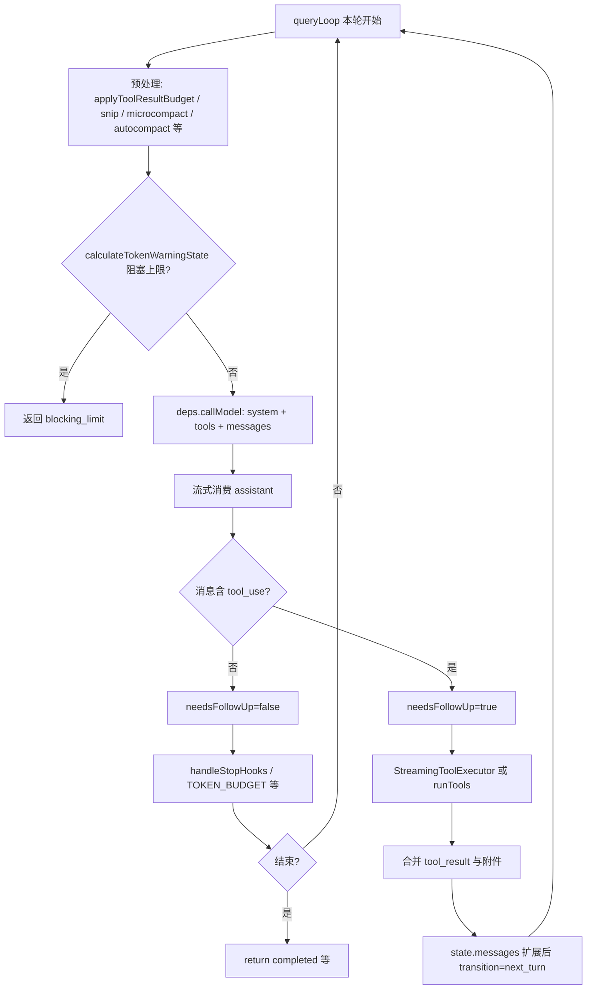

# 大模型工具调用与安全机制 — 源码导读

本文基于本仓库源码，说明：**用户发话之后**，系统如何驱动模型、模型如何产生工具调用、客户端如何执行与安全校验、以及如何监控与压缩上下文。不涉及需翻墙的外部链接。

---

## 思考步骤（阅读本文前可先扫一眼）

1. **「调不调工具」**：以流式 API 返回的 `tool_use` 块为准，本地用 `needsFollowUp` 驱动后续执行与再请求。
2. **「调哪个」**：模型在当次请求附带的 tools 列表 + 系统提示约束下自选；Tool Search 模式下 deferred 工具会动态「解锁」进列表。
3. **「顺序」**：模型侧用多轮对话表达强依赖；同一轮内多个无依赖 `tool_use` 可并行；客户端再按 `isConcurrencySafe` 决定是否真并发执行。
4. **「安全」**：执行前 `hasPermissionsToUseTool` + UI 层 `canUseTool`；工具结果与单条 user 消息有体积预算。
5. **「上下文」**：发请求前 token 估算、阻塞上限、自动/反应式 compact、可选 token budget 续跑。

---

## 总览：一次用户回合在代码里怎么走

核心循环在 [`src/query.ts`](src/query.ts) 的 `queryLoop`：每一轮把当前 `messages`（经 compact 边界截取、工具结果预算、snip、microcompact 等预处理）交给模型；若 assistant 流里出现 **`tool_use`**，则执行工具、生成 **`tool_result`**（及附件），把 `messagesForQuery + assistantMessages + toolResults` 作为下一轮输入 **递归** 进入同一循环，直到某轮不再产生 `tool_use` 且通过 stop hook / token budget 等检查后结束。

要点：**是否再调模型**由上一轮是否产出了待执行的 `tool_use`、以及 stop hook / 中止等分支共同决定，而不是单独某个 `if (userWantsTools)` 标志。

---

## 一、模型侧：何时调用工具、选哪个、顺序怎么定

### 1.1 何时调用工具（谁来「决定」）

- 协议层面：模型在 assistant 消息里输出类型为 `tool_use` 的 content block，即表示要调用工具。
- 本仓库实现：在 `queryLoop` 内消费 `deps.callModel(...)` 的流时，若某条 assistant 消息的 `content` 里存在 `tool_use`，则把对应块收集到 `toolUseBlocks`，并置 **`needsFollowUp = true`**（见 [`src/query.ts`](src/query.ts) 中 `msgToolUseBlocks.length > 0` 分支）。
- 注释中明确：**不要依赖 `stop_reason === 'tool_use'`**，应以流式过程中是否出现 `tool_use` 为准（同文件内对 Anthropic tool use 文档的引用及注释）。

因此：**本地没有单独跑一个「意图分类器」来决定调不调工具**；调不调由模型在本轮生成内容是否包含 `tool_use` 体现。

### 1.2 调用哪一个、调用哪些

- 每次请求会传入 **`tools: toolUseContext.options.tools`**（见 [`src/query.ts`](src/query.ts) 调用 `deps.callModel` 处），工具对象类型见 [`src/Tool.ts`](src/Tool.ts)（`name`、`inputSchema` / `inputJSONSchema`、`call`、`checkPermissions` 等）。
- 模型可见的工具说明来自各工具实现的 schema 及 prompt 组装逻辑（不同工具在 `buildTool` / MCP 包装等处注册）。
- **系统提示**在 [`src/constants/prompts.ts`](src/constants/prompts.ts) 的 `getUsingYourToolsSection` 等处约束行为（例如优先用 Read/Write/Edit 而非 Bash 做文件操作），与 tools 列表一起影响模型选型。

### 1.3 Tool Search 与 deferred 工具（动态缩小/扩大可见工具集）

[`src/services/api/claude.ts`](src/services/api/claude.ts) 中 `queryModel` 会根据 `isToolSearchEnabled(...)` 决定是否启用 Tool Search。启用时：

- 预先计算 **`deferredToolNames`**（`isDeferredTool(t)` 为真的工具名集合）。
- **`filteredTools`** 规则概要：非 deferred 工具始终带上；`ToolSearchTool` 始终带上；deferred 工具仅当在消息历史里已被 **`tool_reference` 发现**（`extractDiscoveredToolNames(messages)`）后才进入发给 API 的列表。

这样模型在工具很多时可以先通过 **ToolSearch** 检索/选择，再在下几轮获得目标 deferred 工具的完整 schema。详见同文件中「Dynamic tool loading」注释段。

### 1.4 调用顺序（模型编排）

同一轮 assistant 里可以包含 **多个** `tool_use` 块。系统提示在 `getUsingYourToolsSection` 中写明（[`src/constants/prompts.ts`](src/constants/prompts.ts)）：

- 无依赖的多个调用应在 **同一轮并行** 发出；
- 若后一个调用的参数依赖前一个的结果，则 **不要并行**，应通过 **多轮**（上一轮 tool_result 进入历史后再请求）顺序完成。

API 侧 **`toolChoice`** 在本主循环调用中为 **`undefined`**（见 [`src/query.ts`](src/query.ts) 的 `callModel` options），即不强制某一工具，由模型在允许列表内自行决定。

---

## 二、客户端执行：一轮里多个 `tool_use` 怎么跑

工具执行入口在 `needsFollowUp` 为真之后：根据配置使用 **`StreamingToolExecutor`**（流式执行）或 **`runTools`**（[`src/services/tools/toolOrchestration.ts`](src/services/tools/toolOrchestration.ts)）。

[`runTools`](src/services/tools/toolOrchestration.ts) 的核心逻辑：

1. **`partitionToolCalls`**：按顺序遍历本轮的 `toolUseBlock[]`，根据 `findToolByName` + `inputSchema.safeParse` + 工具的 **`isConcurrencySafe`** 把列表切成若干 batch。
2. 每个 batch 要么是 **单个非并发安全** 工具，要么是 **连续多个并发安全** 工具。
3. 并发安全 batch 走 **`runToolsConcurrently`**（并发上限由 `getMaxToolUseConcurrency` 读取环境变量 `CLAUDE_CODE_MAX_TOOL_USE_CONCURRENCY`，默认 10）；否则 **`runToolsSerially`**。

与上一节的关系：**模型**决定同一轮发几个 `tool_use` 以及块顺序；**客户端**在「不破坏安全」前提下对「只读且声明可并发」的调用做并行，以缩短_wall time_。

---

## 三、安全边界与权限

### 3.1 执行前权限管道

核心函数 **`hasPermissionsToUseTool`**（及内部的 `hasPermissionsToUseToolInner`）在 [`src/utils/permissions/permissions.ts`](src/utils/permissions/permissions.ts)，典型步骤包括（顺序以源码为准）：

- 工具级 **deny/ask** 规则（`getDenyRuleForTool` / `getAskRuleForTool`）；
- 解析输入后调用各工具的 **`checkPermissions`**（如 Bash 路径与命令规则）；
- 与 **bypassPermissions**、**plan 模式**、**safetyCheck**（部分路径在 bypass 下仍须询问）等组合逻辑；
- 另有 **`checkRuleBasedPermissions`** 等子集接口供特殊场景使用。

Bash 等 shell 类工具有独立模块做细粒度校验，例如 [`src/tools/BashTool/bashPermissions.ts`](src/tools/BashTool/bashPermissions.ts) 中的 `bashToolCheckPermission`（deny/ask 规则优先于路径约束等）。

### 3.2 UI / 交互层 `canUseTool`

REPL 通过 hook **`useCanUseTool`**（[`src/hooks/useCanUseTool.tsx`](src/hooks/useCanUseTool.tsx)）注入 **`CanUseToolFn`**：在权限结果为 ask/deny 等时展示确认队列、协调模式（coordinator）、swarm worker 等分支，最终 resolve 为允许或拒绝后再进入 `tool.call`。

类型定义见同文件导出的 **`CanUseToolFn`**。

### 3.3 工具结果体积与「对话内」预算

常量见 [`src/constants/toolLimits.ts`](src/constants/toolLimits.ts)（如 `DEFAULT_MAX_RESULT_SIZE_CHARS`、`MAX_TOOL_RESULT_TOKENS`、`MAX_TOOL_RESULTS_PER_MESSAGE_CHARS` 等）。

在每轮 `queryLoop` 开始、对 **`messagesForQuery`** 预处理时调用 **`applyToolResultBudget`**（[`src/utils/toolResultStorage.ts`](src/utils/toolResultStorage.ts)，于 [`src/query.ts`](src/query.ts) 引用）：限制 **单条 user 消息内多条 tool_result 合计** 过大时落盘/替换为预览，避免一轮并行工具把上下文撑爆（与文件中注释「N parallel tools」一致）。

---

## 四、上下文监控与续航

### 4.1 发请求前的「硬阻塞」与阈值

[`src/query.ts`](src/query.ts) 在调用模型前使用 **`calculateTokenWarningState`**（[`src/services/compact/autoCompact.ts`](src/services/compact/autoCompact.ts)）结合 **`tokenCountWithEstimation(messagesForQuery)`**（及 snip 释放的 token 调整）判断 **`isAtBlockingLimit`**。若为真，则直接 yield 错误类 assistant 消息并 **`return { reason: 'blocking_limit' }`**，避免在用户关闭自动 compact 时把上下文顶穿。

### 4.2 自动 compact、超长与恢复

同一文件 `queryLoop` 中还包含：

- **自动 compact** 路径（`autoCompactTracking`、压缩后继续）；
- **Prompt too long（413）**  withheld 后的 **context collapse drain**、**reactive compact** 等恢复分支；
- **`max_output_tokens`** 的 withheld 与递增恢复 user meta 消息等。

上下文窗口解析辅助函数在 [`src/utils/context.ts`](src/utils/context.ts)（如 `getContextWindowForModel`）。

### 4.3 Token budget 续跑（特性开关）

当 `feature('TOKEN_BUDGET')` 为真时，在回合末通过 **`checkTokenBudget`**（[`src/query/tokenBudget.ts`](src/query/tokenBudget.ts)）决定是注入 **meta user 消息** 促使继续，还是记录 **`tengu_token_budget_completed`** 并停止（见 [`src/query.ts`](src/query.ts) 中 `TOKEN_BUDGET` 分支）。

### 4.4 发给 API 前的消息形态

**`normalizeMessagesForAPI`** 等函数在 [`src/utils/messages.ts`](src/utils/messages.ts)（由 `query.ts` 等以 `.js` 扩展名导入，对应编译后的 ESM 路径）中实现，用于把内部消息类型转成 API 所需结构、剥离 UI-only 等，避免无效字段进入模型上下文。

### 4.5 工具回合之间的工具列表刷新

若 `toolUseContext.options.refreshTools` 存在，在一轮工具执行结束后会刷新 `options.tools`，以便 **中途连上的 MCP** 等出现在下一轮（见 [`src/query.ts`](src/query.ts) 中 `refreshTools` 注释块）。

---

## 关键源文件索引

| 主题 | 路径 |
|------|------|
| 主查询循环、needsFollowUp、递归下一轮 | [`src/query.ts`](src/query.ts) |
| API 请求、Tool Search、filteredTools | [`src/services/api/claude.ts`](src/services/api/claude.ts) |
| 工具并发/串行分区与执行 | [`src/services/tools/toolOrchestration.ts`](src/services/tools/toolOrchestration.ts) |
| 流式工具执行（与 runTools 二选一） | [`src/services/tools/StreamingToolExecutor.ts`](src/services/tools/StreamingToolExecutor.ts) |
| 权限核心逻辑 | [`src/utils/permissions/permissions.ts`](src/utils/permissions/permissions.ts) |
| REPL 注入 canUseTool | [`src/hooks/useCanUseTool.tsx`](src/hooks/useCanUseTool.tsx) |
| 系统提示（含并行工具指引） | [`src/constants/prompts.ts`](src/constants/prompts.ts) |
| 工具类型与 deferred 等元数据 | [`src/Tool.ts`](src/Tool.ts) |
| ToolSearch 实现与搜索 | [`src/tools/ToolSearchTool/ToolSearchTool.ts`](src/tools/ToolSearchTool/ToolSearchTool.ts) |
| 工具结果预算 | [`src/utils/toolResultStorage.ts`](src/utils/toolResultStorage.ts)、[`src/constants/toolLimits.ts`](src/constants/toolLimits.ts) |
| 阈值与 auto-compact 相关 | [`src/services/compact/autoCompact.ts`](src/services/compact/autoCompact.ts) |
| Token budget | [`src/query/tokenBudget.ts`](src/query/tokenBudget.ts) |

---

## 小结

- **是否调用工具**：由模型输出是否包含 **`tool_use`** 体现，客户端用 **`needsFollowUp`** 衔接执行与再请求；**不依赖**不可靠的 `stop_reason`。
- **调用哪个/哪些**：由当次请求的 **tools 列表 + 系统提示 + 对话历史** 约束；Tool Search 下 **deferred** 工具动态进入列表。
- **顺序**：**强依赖**靠多轮对话；**弱依赖/无依赖**可在单轮多块并行；客户端对 **isConcurrencySafe** 的块做 **真并发**。
- **安全**：**permissions 管道** + **`canUseTool`** 交互 + 各工具 **checkPermissions**；**结果与消息级预算** 防撑爆上下文。
- **上下文**：**token 估算与阻塞**、**compact 家族**、**normalizeMessagesForAPI**、可选 **TOKEN_BUDGET**。

如需把某一节展开到「逐函数调用栈」级别，可指定从 `queryLoop` 或 `queryModel` 起点做二次拆解。
